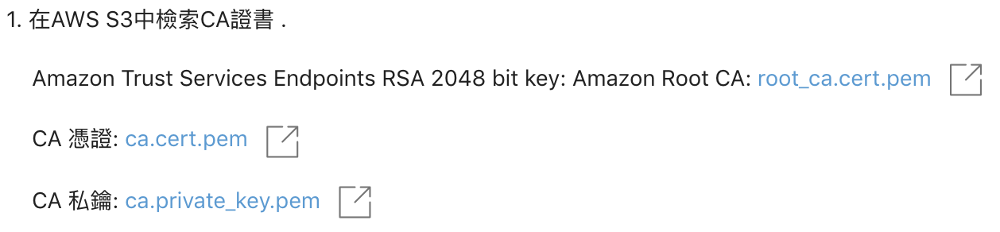

# sensor.live-things-registry-embedded-c-mbed-tls

## Getting Started
產生連接到AWS IoT的自簽名的設備證書


### Prerequisites

註冊[AWS](https://aws.amazon.com/)帳號

註冊[sensor.live](https://sensor.live)帳號並建立一個專案

進入你的專案 > 選擇物聯網管理 > 選擇物件類型 > 建立一個物件類型 > 設定你的條件後建立 > 完成

進入剛剛建立的物件類型 > 往下滑動到物件自動註冊 > 啟用物件自動註冊模組

啟用成功後 > 下載憑證檔



下載mbedtls
```
git clone git@github.com:ARMmbed/mbedtls.git
```

```
cd mbedtls; make
```

### Installing

以上完成後在mbedtls檔案路徑中下載這個專案

```
git clone git@github.com:SoftChef/sensor.live-things-registry-embedded-c-mbed-tls.git
```

```
make
```
將剛剛下載的憑證檔放進資料夾

## Running the tests

Run script
```
./sample.sh
```

## Built With

* [mbedtls](https://github.com/ARMmbed/mbedtls) - An open source, portable, easy to use, readable and flexible SSL library
* [sensor.live](https://www.softchef.com/sensorlive) - IoT Platform SaaS


## License

This project is licensed under the MIT License - see the [LICENSE.md](LICENSE.md) file for details

## Todo

* 增加檢查檔案
* 整理產生檔案的位置
****